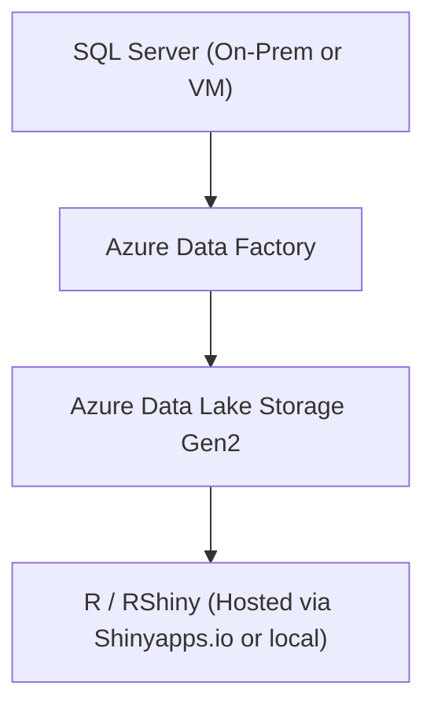

# 🚀 North Star Project 2 Output: Azure Data Factory → RShiny Cloud Visualization

## 🎯 Objective

Level up from local development to cloud-scale data engineering by learning how to **move data from SQL Server to Azure Data Lake** and then **visualize it in RShiny**. This project builds real-world, resume-ready experience using Azure tools and end-to-end integration skills.

---

## 1. 📐 Architecture Diagram (GitHub-Compatible Mermaid)



---

## 2. 🔧 Tools & Services Used

| Tool                     | Purpose                                        |
| ------------------------ | ---------------------------------------------- |
| **SQL Server**           | Source database                                |
| **Azure Data Factory**   | ETL pipeline & data movement                   |
| **Azure Data Lake Gen2** | Cloud storage for structured/unstructured data |
| **R + Shiny**            | Visualization frontend (can be hosted)         |
| **Azure Portal**         | Setup + monitoring                             |

---

## 3. 🧠 Step-by-Step Setup

### Step 1: Prepare SQL Server

* Ensure your SQL Server has outbound internet access (for Azure integration)
* Create a table, e.g.:

```sql
CREATE TABLE ProductionData (
    id INT PRIMARY KEY,
    factory_name VARCHAR(50),
    units_produced INT,
    timestamp DATETIME
);
```

* Insert mock data

---

### Step 2: Configure Azure Data Factory

* Create a new **Data Factory** via Azure Portal
* Set up a **Linked Service** for SQL Server (use gateway or connection string)
* Create another **Linked Service** for Azure Data Lake
* Build a simple **Copy Data pipeline**:

  * Source: SQL Server
  * Sink: Azure Data Lake (CSV or Parquet)
  * Set refresh frequency (e.g., daily, hourly)

---

### Step 3: Validate in Azure Data Lake

* Check that your pipeline delivered `.csv` or `.parquet` to the Lake folder
* You can preview via Azure Storage Explorer or portal

---

### Step 4: RShiny to Read Cloud File

```r
library(shiny)
library(readr)
library(plotly)

ui <- fluidPage(
  titlePanel("Factory Production Dashboard"),
  plotlyOutput("plot")
)

server <- function(input, output) {
  output$plot <- renderPlotly({
    # Replace with your actual Azure Data Lake file URL if public, or download locally
    df <- read_csv("production_data.csv")
    plot_ly(df, x = ~timestamp, y = ~units_produced, color = ~factory_name,
            type = 'scatter', mode = 'lines+markers')
  })
}

shinyApp(ui, server)
```

> Note: For secure access to ADLS Gen2 files from R, you'd likely stage the file locally (via scheduled download or API) unless using enterprise R setups.

---

## 4. 📦 GitHub Repo Best Practices

```
azure-data-rshiny/
├── sql/
│   └── production_schema.sql
├── rshiny/
│   └── app.R
├── adf/
│   └── pipeline_export.json (ADF pipeline export)
├── README.md
└── LICENSE
```

---

## 5. 🧰 Tips for Success

* Start with **manual pipeline triggers** then schedule
* Learn ADF’s built-in monitoring tools for error debugging
* Document your repo with screenshots of Azure setup, pipeline success, and app output
* Use `config.yml` or `.Renviron` for sensitive paths and tokens
* If stuck, reference ADF templates in the Azure Gallery

---

## 6. 💼 Resume & Interview Value

| Skill Demonstrated | Why It Matters                                 |
| ------------------ | ---------------------------------------------- |
| ETL Design         | Every org moves data — show you can, too       |
| Azure Integration  | Cloud skills stand out for modern data roles   |
| Shiny Visuals      | Translating raw data into insights is powerful |
| GitHub Structure   | Hiring managers love clean, versioned projects |

---

## 🧭 What’s Next? Project 3 Teaser:

> **“Train a simple ML model on your Azure data and visualize prediction confidence in R.”**

Let me know when you're ready for that one too.
