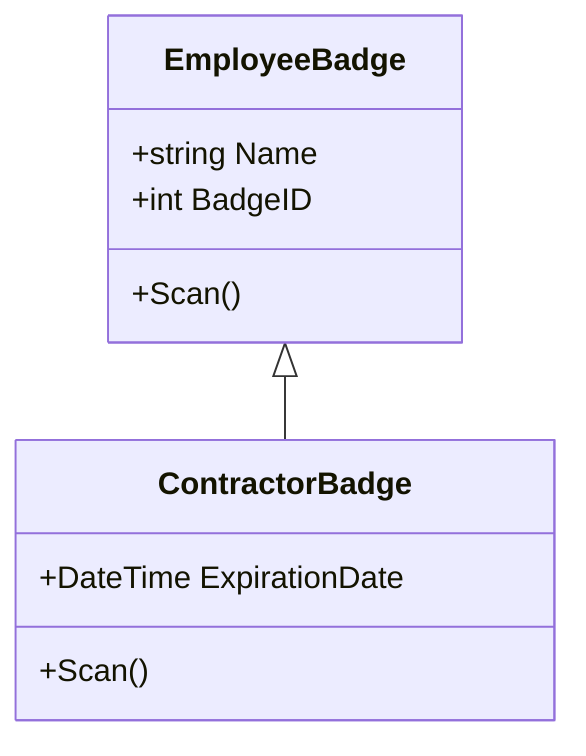
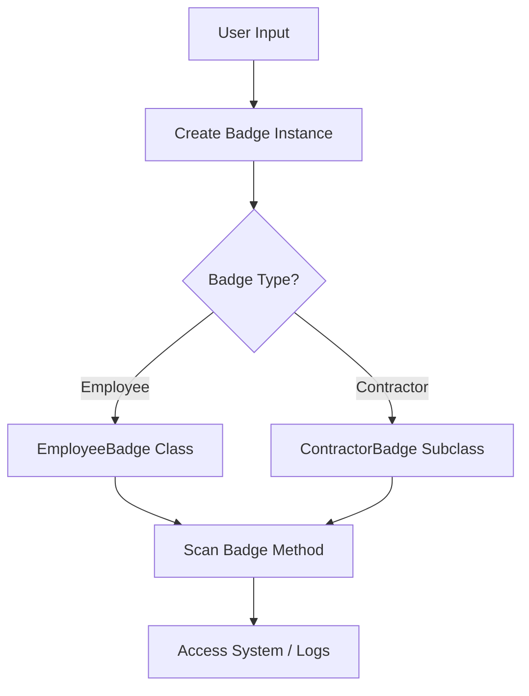

# 🛠️ Upgrades and Enterprise Features for OOP Badge Training

This file contains enhancements to elevate the OOP Badge System training from a foundational learning resource to a production-grade, enterprise-ready module. These suggestions are curated for internal onboarding, technical mentorship, or hackathon base repos.

---

## 🔤 Naming Convention Fixes

### 📌 Fix for Level 3:

* Rename `badgeID` ➝ `BadgeID` to follow **PascalCase**, aligning with .NET conventions for public members.

```csharp
private int BadgeID;
```

### 🧠 Recommendation:

Adopt consistent naming conventions across all levels:

* **Classes:** PascalCase
* **Properties:** PascalCase
* **Private fields:** `_camelCase`
* **Methods:** PascalCase

---

## 🧪 Unit Testing Scaffold

Introduce testing early with MSTest or xUnit.

### ✅ MSTest Example (Level 1):

```csharp
[TestClass]
public class EmployeeBadgeTests
{
    [TestMethod]
    public void Constructor_SetsPropertiesCorrectly()
    {
        var badge = new EmployeeBadge("Anaizat", 1001, "HR");
        Assert.AreEqual("Anaizat", badge.Name);
        Assert.AreEqual(1001, badge.BadgeID);
        Assert.AreEqual("HR", badge.Department);
    }
}
```

---

## 📈 Mermaid Diagrams (Visuals)

### 🧩 Class Inheritance Flow



### ⚙️ System Flow Overview



---

## ☁️ Azure Functions Integration (Sample)

### 🔗 Sample Function to Issue Badge

```csharp
[FunctionName("IssueBadge")]
public static IActionResult Run(
    [HttpTrigger(AuthorizationLevel.Function, "post", Route = null)] HttpRequest req,
    ILogger log)
{
    string name = req.Query["name"];
    string department = req.Query["department"];
    var badge = new EmployeeBadge(name, 1234, department);
    return new OkObjectResult($"Badge created for {badge.Name}");
}
```

---

## 🧱 ARM/Bicep Template for Dev Environment

### 🚀 Provision Resources (Bicep)

```bicep
param functionAppName string = 'oopBadgeApi'
param location string = resourceGroup().location

resource appServicePlan 'Microsoft.Web/serverfarms@2022-03-01' = {
  name: '${functionAppName}-plan'
  location: location
  sku: {
    name: 'Y1'
    tier: 'Dynamic'
  }
}

resource functionApp 'Microsoft.Web/sites@2022-03-01' = {
  name: functionAppName
  location: location
  kind: 'functionapp'
  properties: {
    serverFarmId: appServicePlan.id
    siteConfig: {
      appSettings: [
        {
          name: 'FUNCTIONS_WORKER_RUNTIME'
          value: 'dotnet'
        }
      ]
    }
  }
}
```

---

## 💬 Logging + Validation Enhancement

### 🛡️ Add Logging to `SetBadgeID()`

```csharp
public void SetBadgeID(int newID)
{
    if (newID > 0)
    {
        badgeID = newID;
        Console.WriteLine($"BadgeID updated to {newID}");
    }
    else
    {
        Console.WriteLine("Invalid ID. Update failed.");
    }
}
```

---

## 🧭 Final Thoughts

Use this upgrade module to:

* ✅ Enhance onboarding for new devs
* 🧪 Introduce DevOps principles
* 🔄 Promote testable, scalable code
* 🧠 Encourage visual thinking and architectural rigor
